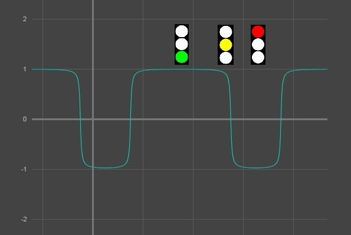
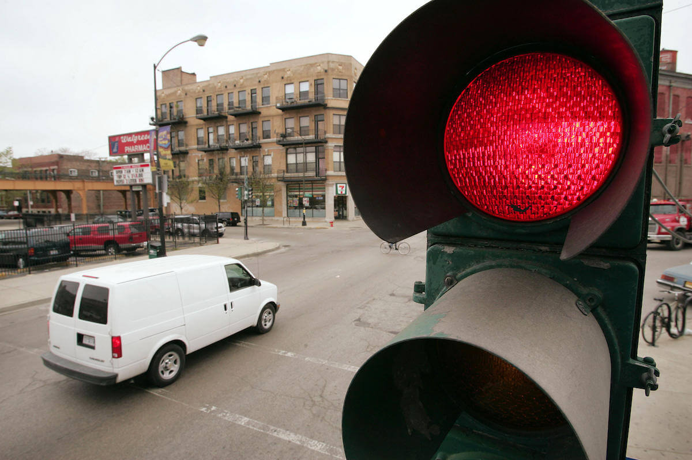
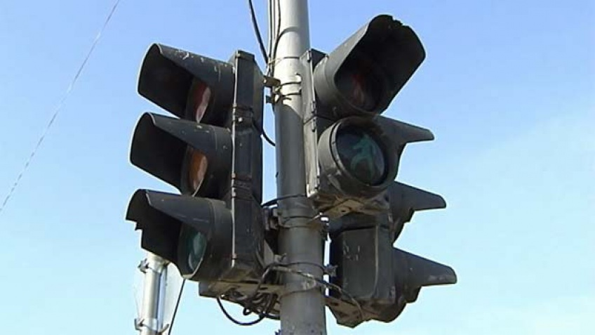

@title[Introduction]
# HackThings
### HackTrafficLights

Дмитрий Куликов

SkolTech, 07.09-09.09.2018

---
@title[Goal]

## Цель
Превратить обычный светофор в интеллектуальный

---
@title[TrafficLight:Dummy]
### Светофор обычный
- установлен простой контроллер
- работает в одном или нескольких фиксированных режимах

---
@title[TrafficLight:Intelligence]
### Светофор интеллектуальный
- цифровой двойник (математическая модель)
- онлайн-сервис с API

---
@title[Goal]

## Ограничения
- Сами светофоры не менять
- Ничего в них не устанавливать
- Не использовать компьютерное зрение

---
@title[MainIdea]

## Решение задачи
#### IoT + Socium Intelligence

---
@title[MainIdea]

### IoT
Устройства GNSS (GPS/ГЛОНАСС/BeiDou/Gallileo)

---
@title[SociumIntelligence]
### Socium Intelligence

Направлено на получение знаний и инсайтов на основе данных о поведении
индивидов в обществе, в котором "нарушителей" подавляющее
меньшинство.

---
@title[SocimIntelligence: Socium vs Croud]
## Socium Intelligence

Is not ~~Croud Intelligence~~

---?image=assets/images/HackThings-01.jpeg&size=auto 90%&color=black @title[SociumIntelligence: Drivers]

---
@title[Law]
## Принцип законопослушных водителей:

Нет никаких оснований считать какого-либо водителя нарушителем

---
@title[Law]
## ..., а на языке математики:

Создать математическую модель, минимизирующую число нарушителей проезда регулируемых перекрестков

---
@title[Model]
### Математическая модель

---
@title[ModelParams]

### Параметры модели
- Период и длительность каждой фазы
- Начальная фаза (время переключения на разрешающий сигнал)

---
@title[Machine Learning: Stage 1]

### Стадия 1
#### Вычисление периода и длительности фаз
- Назависимая обработка ежедневных архивных данных
- Вычисление наиболее вероятных длительностей фаз
- Кластеризация результатов и вычисление центров кластеров

---
@title[Machine Learning: Stage 2]

### Стадия 2
#### Вычисление начала разрешающей фазы
- Онлайн обработка данных
- Фиксация периода и длительностей фаз
- Периодическая перестройка модели (проблема рассинхронизации) 

---
@title[Math 1]

### Функция потерь
`\[
L = \frac{1}{N}\sum_{k=1}^N \left( 1 - \arctan(\alpha \sin( \frac{2 \pi (t-φ)}{T} ) + \gamma)) \right)^2 + \lambda (T-T_0)^2
\]`

+++
@title[Math 2]

#### Зависимые параметры:
- **T** - период работы
- **γ** - ассиметрия длительностей фаз 
- **φ** - начальная фаза (время перекоючения на разрешающий сигнал)

+++
@title[Math 3]
#### Гиперпараметры модели:
- **α** - длительность фазового перехода - размер "штрафа" за проезд при смене сигнала
- **T0** - априорное значение периода
- **λ** - регуляризационный параметр

---
@title[Sarov]
### Город Саров
- 95 тыс. жителей
- 40 тыс. автомобилей
- 200 километров дорог общего пользования
- 34 регулируемых перекрестка

---
@title[GLONASS]
### Устройства ГЛОНАСС
- 40 муниципальных автобусов
- 20 маршрутных такси
- 40 единиц коммунальной техники

---
@title[DataSet]
### Набор данных
- Ежедневно: около 400 тыс. отметок
- Май-август 2018 года: 40 млн. отметок

---?video=https://www.youtube.com/watch?v=0pv001VbW8s&feature=youtu.be
---?video=https://youtu.be/mpIAsFsaqw0
+++?video=https://youtu.be/srP1JEM9fCA
---
@title[Buiseness:Goverment]
## Применение
#### Моделирование транспортных потоков
- Определение "узких" мест
- Оптимизация работы совокупности светофорных объектов

---
@title[Buiseness:Consumers 1]
## Применение
#### Зелёная улица

---
@title[Buiseness:Consumers 1]
## Применение
#### Единичная аномалия?

@title[Buiseness:Consumers 2]
## Применение
#### Множественные аномалии?

---
@title[Thanks]
## Спасибо за внимание

Mail: kulikov@sarov.info

Telegram: @DmitryKulikov
